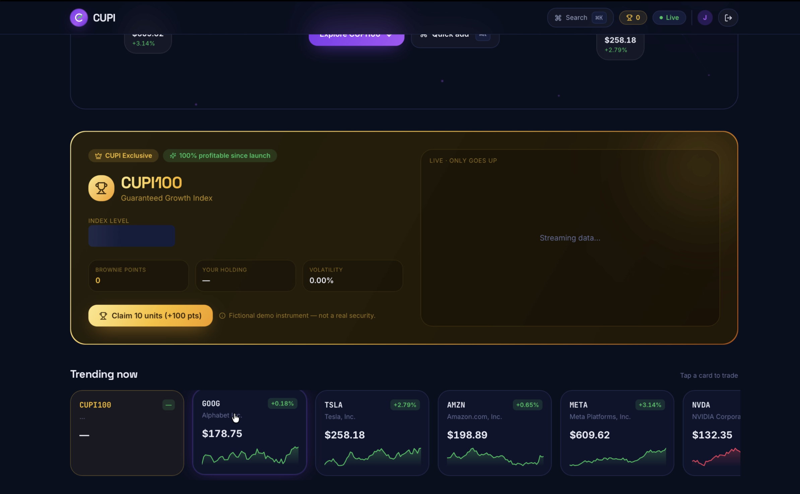
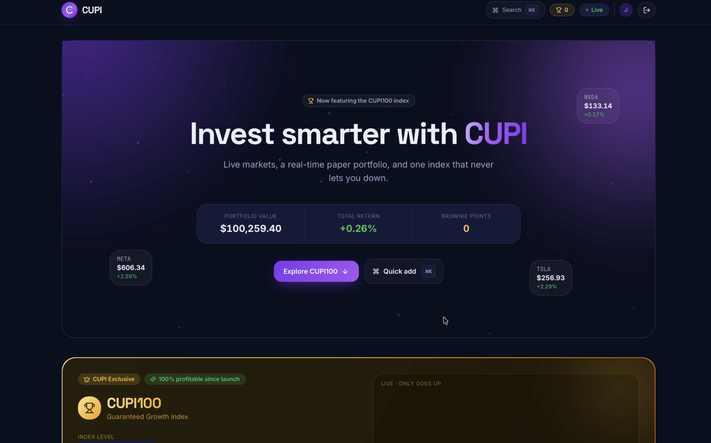

# CUPI — Real-Time Trading Terminal

## Dashboard Preview



## 🏆 CUPI100 Exclusive Feature



## 🎥 Demo Video

[Watch Demo Video](./assets/ezgif.com-video-cutter.mov)

https://github.com/SuyashAlva/cupi-trading-dashboard
A premium, real-time trading dashboard with a strong visual identity. Sign in, watch live prices stream over Socket.io, build a watchlist, and run a paper-trading portfolio that marks to market every second — wrapped in a dark-violet brand world built to be *remembered*, not to look like an admin template.

> Prices are synthesised by a server-side engine, so it runs with zero API keys and zero cost. **CUPI100** is a fictional, always-up "house" index used as a branded demo easter-egg.

```
   Invest smarter with CUPI
   ───────────────────────────────────────────────
   ✦ aurora + floating particles · giant gradient headline ✦
   [ Portfolio $101,240 ]  [ Return +1.24% ]  [ 🏆 320 pts ]

   ┌─ CUPI100 · Guaranteed Growth Index ───── GOLD ─┐
   │ 🏆  $1,007.68   ▲ +0.77%   100% profitable      │
   │ ╱╱╱╱╱╱ live gold chart — only goes up ╱╱╱╱╱╱╱╱ │
   └─────────────── fictional demo instrument ───────┘
```


---

## Visual identity

A deliberate brand world, documented in **[docs/CUPI-BRAND.md](docs/CUPI-BRAND.md)**:

- **Deep-navy canvas** (`#0B1020`, never pure black) with breathing violet **auroras** and a canvas **particle field**.
- **Violet→green brand gradient** (`#7C3AED → #A855F7 → #22C55E`) used for the wordmark and key type; **premium gold** (`#FBBF24`) reserved exclusively for CUPI100.
- **Editorial, asymmetrical layout** — a giant hero, a gold showpiece, a carousel, and an intentionally uneven 12-column grid. No wall of identical cards.
- **Large display type** (Space Grotesk up to 88px), tabular numerics, and motion spent only where it means something.

## CUPI100 — the showpiece

The first thing a reviewer sees after the hero: a gold-framed card with a trophy, a live chart that only climbs, "100% profitable since launch," a "CUPI Exclusive" badge, and **brownie points** for backing it. It's a server-side instrument (`server/src/priceEngine.ts`) that ticks strictly upward — and it's clearly tagged as a fictional demo so it reads as a confident in-joke, not a fake investment claim.

## Highlights

- **Sub-second streaming over Socket.io** — one room per symbol; each tick reaches only its subscribers (isolation-tested).
- **Paper-trading desk** — buy/sell at live price; portfolio + P&L marked to market every tick; allocation donut.
- **Real-time activity feed**, **top movers**, **price alerts** (toast + browser notification), **trending carousel**, **market news**.
- **Command palette (⌘K)**, **slide-over trade drawer**, toasts, skeletons, animated counters, hover glow, price flash.
- **Typed end to end** with a shared Socket.io event contract.

## Tech stack

| Layer | Choice |
|---|---|
| Frontend | React 18 + Vite + TypeScript |
| Server state | React Query |
| Live/client state | Zustand (persist, subscribeWithSelector) |
| Styling | Tailwind CSS + custom CUPI tokens |
| Charts | Recharts + hand-rolled SVG sparklines |
| Motion | Framer Motion + canvas particles |
| Real-time | Socket.io (rooms) |
| Backend | Node + Express, JWT verified in the socket handshake |

## Quick start

Requires Node 18+.

```bash
npm install      # installs both workspaces
npm run dev       # server + client together
```

Client: http://localhost:5173 · Server: http://localhost:8080 (Vite proxies `/api` and `/socket.io`).

Sign in with any email. Open a second browser profile with a different email + watchlist to see independent streams. Headless check:

```bash
npm run dev:server
npm --workspace server run test:e2e     # "Streams isolated per user: PASS ✅"
```

Production build: `npm run build` then `npm start`.

## How the assignment requirements are met

| Requirement | Where |
|---|---|
| Login by email | `POST /api/auth/login` → signed JWT (`server/src/auth.ts`) |
| Subscribe to a ticker | Watchlist + ⌘K validate then emit `subscribe` |
| 5 supported stocks | GOOG, TSLA, AMZN, META, NVDA (+ CUPI100) |
| Update without refresh | Socket.io `tick` → Zustand → reactive re-render |
| Two users, async, isolated | One room per symbol (`server/src/index.ts`) — isolation-tested |
| Random price each second | Geometric random walk, 1s interval |

## Documentation

- **[docs/CUPI-BRAND.md](docs/CUPI-BRAND.md)** — full visual identity & design spec: layout, component hierarchy, exact spacing/typography, animation specs, Tailwind tokens, and a mockup description.
- **[docs/ARCHITECTURE.md](docs/ARCHITECTURE.md)** — system/WebSocket/state/auth architecture, DB schema, scalability, security.
- **[docs/DESIGN.md](docs/DESIGN.md)** — design principles and interaction states.
- **[docs/FEATURES.md](docs/FEATURES.md)** — scored feature catalogue + wow features.
- **[docs/REVIEW.md](docs/REVIEW.md)** — hiring-manager critique, AI-differentiation, resume bullets, interview prep.

## Honest scope

**Implemented & verified** (typecheck + build + isolation test pass): email login, Socket.io streaming, per-user isolation, watchlist, paper trading with live P&L, alerts, CUPI100, the full CUPI identity, and all listed dashboard sections. **Designed, not built:** Postgres persistence (schema in ARCHITECTURE.md) and candlestick/indicators. CUPI100 is intentionally fictional.


## License

MIT — see [LICENSE](LICENSE).
